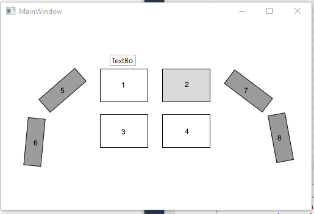

# SensorShirt
Sensor Shirt
We built a SensorShirt to collect data for the amount of pressure exerted during hugs. The goal it to collect data on the areas where more pressure is exerted and with this data we will build our HugBot so that it can mimic human hugs.

